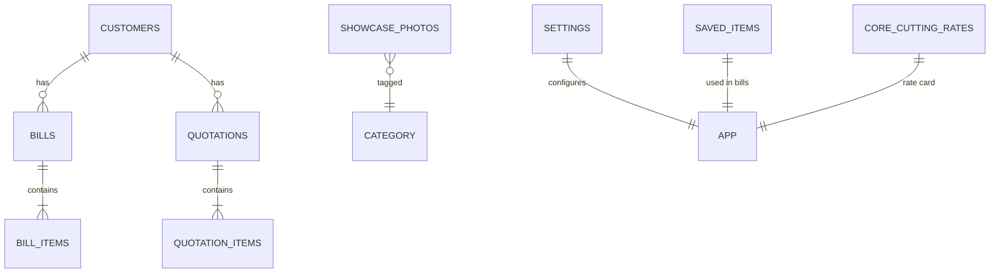
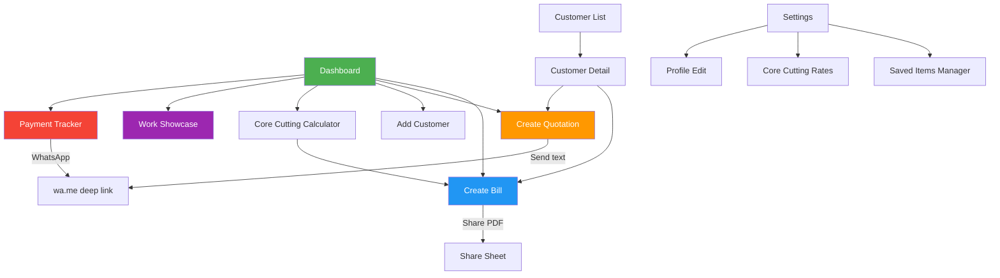

# Plum — Indie Tradesman App

A bilingual (Marathi / English) Flutter Android app for a single plumber + core cutter in India.
Fully offline, speed-first — in-out in under 60 seconds for any task.

---

## User Review Required

> [!IMPORTANT]
> **Database ORM choice: Drift (recommended) vs raw sqflite**
> Research strongly favors **Drift** for this project — it gives us type-safe queries, reactive streams (UI auto-updates when data changes), and clean migration management. The only downside is a build_runner code-gen step during development. I recommend Drift unless you have a strong preference for raw SQL.

> [!IMPORTANT]
> **WhatsApp sharing strategy**
> - **PDF bills**: Shared via `share_plus` → opens native Android share sheet → user picks WhatsApp. No way to force-open a specific WhatsApp contact (WhatsApp TOS limitation).
> - **Quotation text**: Shared via `url_launcher` with `https://wa.me/<phone>?text=...` deep link → opens WhatsApp directly to that customer's chat with pre-filled message.
> - **Payment reminders**: Same `wa.me` deep link approach with pre-written Marathi reminder text.

> [!WARNING]
> **Plumber's own profile data** — The bill PDF header needs the plumber's name + phone number. I'll store this in a single-row `settings` table (editable in Settings screen). First launch will prompt for this info.

## Open Questions

1. **App name**: I'm using **"Plum"** as the project/package name. What should the display name be on the home screen? Something like **"माझा व्यवसाय"** (My Business) or just **"Plum"**?
2. **Bill numbering**: Should bills have auto-incrementing bill numbers (e.g., Bill #001, #002)? This is useful for record-keeping.
3. **Bill PDF language**: Should the PDF bill be generated in the currently selected language, or always in a specific language (e.g., always Marathi, or always English)?
4. **Quotation items**: You mentioned "add item name + qty" for quotations. Should quantities have units (e.g., "10 feet", "2 bags") or just plain numbers?
5. **Core cutting sizes**: You listed 2", 4", 6", 8" — should I also include 3", 5", 10", 12" or are those four the standard set? Should the plumber be able to add custom sizes?
6. **Showcase photos limit**: Any max number of photos to store? Photos can consume significant storage over time.

---

## Tech Stack

| Concern | Package | Why |
|---|---|---|
| Database | `drift` + `sqlite3_flutter_libs` | Type-safe, reactive, migration support |
| PDF generation | `pdf` | Industry standard, widget-style API |
| File sharing (bills) | `share_plus` | Native share sheet for PDF files |
| WhatsApp deep links | `url_launcher` | `wa.me` links for quotations & reminders |
| Camera / gallery | `image_picker` | Photo capture for work showcase |
| File paths | `path_provider` | App document directory for photos & PDFs |
| Localization | `flutter_localizations` + `intl` | Built-in ARB-based i18n with Marathi support |
| State management | `provider` | Simple, sufficient for single-user app |
| Fonts | Google Fonts (`Noto Sans Devanagari`) | Proper Marathi rendering on all devices |

---

## Database Schema

### Table: `settings` (single row)
| Column | Type | Notes |
|---|---|---|
| `id` | INTEGER PK | Always 1 |
| `owner_name` | TEXT | Plumber's name (bill header) |
| `owner_phone` | TEXT | Plumber's phone (bill header) |
| `locale` | TEXT | `'en'` or `'mr'`, default `'mr'` |

---

### Table: `customers`
| Column | Type | Notes |
|---|---|---|
| `id` | INTEGER PK AUTO | |
| `name` | TEXT NOT NULL | |
| `phone` | TEXT NOT NULL | |
| `address` | TEXT | Optional |
| `created_at` | INTEGER | Unix timestamp |

**Index**: `name`, `phone` (for instant search)

---

### Table: `saved_items`
| Column | Type | Notes |
|---|---|---|
| `id` | INTEGER PK AUTO | |
| `name` | TEXT NOT NULL | e.g., "Pipe Fitting", "मजुरी" |
| `default_price` | REAL NOT NULL | Default price in ₹ |
| `sort_order` | INTEGER | For custom ordering |

---

### Table: `bills`
| Column | Type | Notes |
|---|---|---|
| `id` | INTEGER PK AUTO | |
| `customer_id` | INTEGER FK → customers | |
| `bill_number` | INTEGER | Auto-incrementing |
| `total_amount` | REAL | Computed total |
| `amount_paid` | REAL | Default 0 |
| `created_at` | INTEGER | Unix timestamp |
| `is_paid` | INTEGER | 0 = pending, 1 = paid |

---

### Table: `bill_items`
| Column | Type | Notes |
|---|---|---|
| `id` | INTEGER PK AUTO | |
| `bill_id` | INTEGER FK → bills | |
| `item_name` | TEXT | |
| `quantity` | REAL | Default 1 |
| `unit_price` | REAL | |
| `total` | REAL | qty × price |

---

### Table: `quotations`
| Column | Type | Notes |
|---|---|---|
| `id` | INTEGER PK AUTO | |
| `customer_id` | INTEGER FK → customers | |
| `created_at` | INTEGER | Unix timestamp |

---

### Table: `quotation_items`
| Column | Type | Notes |
|---|---|---|
| `id` | INTEGER PK AUTO | |
| `quotation_id` | INTEGER FK → quotations | |
| `item_name` | TEXT | |
| `quantity` | REAL | |
| `unit` | TEXT | Optional: "feet", "bags", "nos" |

---

### Table: `showcase_photos`
| Column | Type | Notes |
|---|---|---|
| `id` | INTEGER PK AUTO | |
| `file_path` | TEXT | Path to saved image on device |
| `category` | TEXT | `'plumbing'` or `'core_cutting'` |
| `created_at` | INTEGER | Unix timestamp |

---

### Table: `core_cutting_rates`
| Column | Type | Notes |
|---|---|---|
| `id` | INTEGER PK AUTO | |
| `hole_size` | TEXT | e.g., `"2\""`, `"4\""` |
| `price_per_hole` | REAL | ₹ per hole |
| `sort_order` | INTEGER | Display order |

---

### ER Diagram



---

## Screen List & Navigation Flow

### Bottom Navigation Bar (4 tabs)

| Tab | Icon | Screen | Primary Action |
|---|---|---|---|
| 🏠 Home | home | Dashboard | Quick actions grid |
| 👥 ग्राहक | people | Customer List | Search + tap to view |
| 💰 बाकी | account_balance | Payment Tracker | Pending balances |
| ⚙️ Settings | settings | Settings | Language, profile, rates |

---

### All Screens (10 total)

#### 1. **Dashboard** (`/`)
- 6-tile quick action grid:
  - ➕ नवीन बिल (New Bill)
  - 📋 अंदाजपत्रक (New Quotation)
  - 👤 ग्राहक जोडा (Add Customer)
  - 🔩 Core Cutting Calculator
  - 📸 काम दाखवा (Work Showcase)
  - 💰 बाकी रक्कम (Pending Payments)
- Recent activity feed (last 5 bills/quotations)

#### 2. **Customer List** (`/customers`)
- Search bar at top (instant search by name or phone)
- Alphabetical list with avatar initials
- FAB → Add Customer bottom sheet

#### 3. **Customer Detail** (`/customers/:id`)
- Customer name, phone, address at top
- Tab bar: Bills | Quotations
- Each bill shows: date, amount, paid/pending badge
- Each quotation shows: date, item count
- "बाकी रक्कम: ₹X" balance banner if pending

#### 4. **Create Bill** (`/bills/new`)
- Step 1: Pick customer (search + select, or recent customers)
- Step 2: Cart-style item picker
  - Saved items shown as tappable chips/cards
  - Tap → item added to cart with default price & qty=1
  - Inline edit qty and price per line item
  - Custom item: "+" button → name + price mini-form
  - **Live running total** pinned at bottom
- Step 3: Confirm → generates bill → shows share options
  - "Share as PDF on WhatsApp" button
  - "Mark as Paid" toggle

#### 5. **Create Quotation** (`/quotations/new`)
- Step 1: Pick customer (same picker as bill)
- Step 2: Add items
  - Item name + quantity input (simple rows)
  - "+" to add more rows
  - No prices — this is a material shopping list
- Step 3: Confirm → preview formatted text → "Send on WhatsApp" button
  - Opens WhatsApp directly to customer's number with formatted text

#### 6. **Payment Tracker** (`/payments`)
- List of all customers with pending balance (sorted highest first)
- Each row: customer name, phone, total बाकी रक्कम
- Swipe right or tap → "Mark Paid" (one-tap)
- Tap WhatsApp icon → sends pre-written Marathi reminder via `wa.me` deep link

#### 7. **Core Cutting Calculator** (`/calculator`)
- Rate card display (editable in settings)
- Input: select hole size from chips → enter quantity
- Instant price calculation displayed prominently
- "Add to Bill" button → navigates to Create Bill with item pre-filled

#### 8. **Work Showcase** (`/showcase`)
- Full-screen gallery grid (2 columns)
- Filter tabs: All | Plumbing | Core Cutting
- Tap photo → fullscreen view with swipe navigation
- FAB → camera (2 taps: capture + pick category + save)
- **No customer names visible** (privacy)

#### 9. **Saved Items Manager** (`/settings/items`)
- List of saved charges with name + default price
- Tap to edit, swipe to delete
- FAB to add new item
- Drag to reorder

#### 10. **Settings** (`/settings`)
- **Profile**: Plumber's name + phone (for bill header)
- **Language**: Toggle English ↔ मराठी
- **Saved Items**: → navigates to Saved Items Manager
- **Core Cutting Rates**: Edit rate card (hole sizes + prices)
- **About**: App version

---

### Navigation Flow Diagram



---

## Folder / File Structure

```
plum/
├── android/                          # Android platform files
├── lib/
│   ├── main.dart                     # App entry point
│   │
│   ├── l10n/                         # Localization ARB files
│   │   ├── app_en.arb                # English strings
│   │   └── app_mr.arb                # Marathi strings
│   │
│   ├── database/                     # Drift database layer
│   │   ├── database.dart             # Main database class + connection
│   │   ├── database.g.dart           # Generated code (drift)
│   │   ├── tables/                   # Table definitions
│   │   │   ├── customers.dart
│   │   │   ├── bills.dart
│   │   │   ├── bill_items.dart
│   │   │   ├── quotations.dart
│   │   │   ├── quotation_items.dart
│   │   │   ├── saved_items.dart
│   │   │   ├── showcase_photos.dart
│   │   │   ├── core_cutting_rates.dart
│   │   │   └── settings.dart
│   │   └── daos/                     # Data Access Objects
│   │       ├── customer_dao.dart
│   │       ├── bill_dao.dart
│   │       ├── quotation_dao.dart
│   │       ├── saved_item_dao.dart
│   │       ├── showcase_dao.dart
│   │       ├── core_cutting_dao.dart
│   │       └── settings_dao.dart
│   │
│   ├── models/                       # View models / DTOs (non-DB)
│   │   ├── bill_with_items.dart      # Bill + its line items
│   │   ├── customer_with_balance.dart # Customer + computed balance
│   │   └── cart_item.dart            # In-memory cart item for bill creation
│   │
│   ├── providers/                    # Provider state management
│   │   ├── locale_provider.dart      # Language toggle state
│   │   ├── cart_provider.dart        # Bill creation cart state
│   │   └── database_provider.dart    # Database instance provider
│   │
│   ├── screens/                      # UI screens
│   │   ├── dashboard/
│   │   │   └── dashboard_screen.dart
│   │   ├── customers/
│   │   │   ├── customer_list_screen.dart
│   │   │   ├── customer_detail_screen.dart
│   │   │   └── add_customer_sheet.dart
│   │   ├── bills/
│   │   │   ├── create_bill_screen.dart
│   │   │   ├── bill_detail_screen.dart
│   │   │   └── widgets/
│   │   │       ├── item_picker.dart
│   │   │       ├── cart_list.dart
│   │   │       └── bill_total_bar.dart
│   │   ├── quotations/
│   │   │   ├── create_quotation_screen.dart
│   │   │   └── quotation_preview_screen.dart
│   │   ├── payments/
│   │   │   └── payment_tracker_screen.dart
│   │   ├── calculator/
│   │   │   └── core_cutting_calculator_screen.dart
│   │   ├── showcase/
│   │   │   ├── showcase_gallery_screen.dart
│   │   │   └── photo_fullscreen_screen.dart
│   │   └── settings/
│   │       ├── settings_screen.dart
│   │       ├── saved_items_screen.dart
│   │       └── core_cutting_rates_screen.dart
│   │
│   ├── services/                     # Business logic services
│   │   ├── pdf_service.dart          # Bill PDF generation
│   │   ├── share_service.dart        # WhatsApp + share sheet helpers
│   │   └── photo_service.dart        # Camera capture + file management
│   │
│   ├── theme/                        # App theming
│   │   └── app_theme.dart            # Colors, text styles, component themes
│   │
│   └── widgets/                      # Shared reusable widgets
│       ├── customer_search_picker.dart
│       ├── empty_state.dart
│       └── confirm_dialog.dart
│
├── l10n.yaml                         # Localization config
├── pubspec.yaml                      # Dependencies
└── README.md
```

---

## Module Build Order

Build in this exact sequence — each phase depends on the previous one.

### Phase 1: Project Scaffold
- Initialize Flutter project in `d:\College\Project\plum`
- Configure `pubspec.yaml` with all dependencies
- Set up `l10n.yaml` and both ARB files (all strings)
- Create `app_theme.dart` with design system
- Set up `main.dart` with `MaterialApp`, localization delegates, bottom nav

### Phase 2: Database Layer
- Define all Drift tables
- Create main `AppDatabase` class
- Write all DAOs with CRUD operations
- Run `build_runner` to generate code
- Seed default data (settings row, default saved items, default core cutting rates)

### Phase 3: Settings Screen + Profile Setup
- Settings screen with language toggle, profile editor
- First-launch flow: prompt for plumber name + phone
- Locale provider for runtime language switching

### Phase 4: Customer Management
- Customer list screen with instant search
- Add customer bottom sheet (name + phone, optional address)
- Customer detail screen (info + tabs for bills/quotations)

### Phase 5: Saved Items Manager
- CRUD screen for saved charges
- Drag to reorder, swipe to delete

### Phase 6: Quick Bill (बिल)
- Cart provider for in-memory bill state
- Customer picker → item picker (tap saved items) → cart view → total bar
- PDF generation service (bill header with plumber info)
- Share via `share_plus` (native share sheet)
- Save bill + items to database
- Mark as paid toggle

### Phase 7: Quick Quotation (अंदाजपत्रक) + Payment Tracker + Core Cutting Calculator
- Quotation creation: customer picker → item rows → WhatsApp text share
- Payment tracker: pending balance list → one-tap mark paid → WhatsApp reminder
- Core cutting calculator: rate card display → size + qty input → instant price → "Add to Bill"

### Phase 8: Work Showcase
- Photo capture via `image_picker` (camera)
- Category tagging (plumbing / core cutting)
- Gallery grid with filter tabs
- Fullscreen photo viewer

---

## Verification Plan

### Automated Tests
```bash
flutter analyze        # Static analysis — zero warnings
flutter test           # Unit tests for DAOs and services
flutter build apk      # Verify APK builds successfully
```

### Manual Verification
- **Database**: Verify all CRUD operations via unit tests on DAOs
- **Localization**: Toggle between English ↔ Marathi — all strings switch
- **Bill PDF**: Generate a bill → verify header, line items, total are correct
- **WhatsApp sharing**: Test on physical Android device with WhatsApp installed
- **Offline**: Airplane mode → all features work (no network calls anywhere)
- **Performance**: Time common flows — should complete in under 60 seconds each
- **Camera**: Capture photo → verify it appears in showcase gallery
